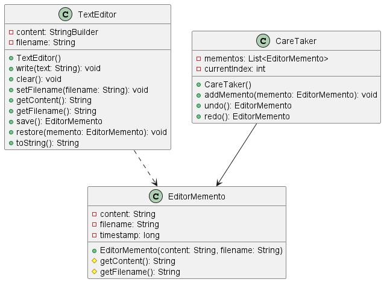

# Padrão de Projeto Memento - Editor de Texto com Desfazer Refazer

## 1. Intenção

O padrão Memento permite capturar e externalizar o estado interno de um objeto sem violar o encapsulamento, permitindo que o objeto seja restaurado para este estado posteriormente. No contexto desta implementação, usamos o padrão Memento para implementar as funcionalidades de "desfazer" e "refazer" em um editor de texto simples.

## 2. Motivação

Em editores de texto, é necessário permitir que o usuário desfaça e refaça operações. Isso exige que o estado do editor seja salvo em diferentes momentos e que seja possível voltar a estados anteriores. O padrão Memento resolve este problema:

- **Preservação do Estado**: Salva o estado do editor em diferentes momentos
- **Manutenção do Encapsulamento**: Protege os detalhes de implementação do editor
- **Gerenciamento do Histórico**: Fornece uma estrutura para navegação no histórico de estados

## 3. Aplicabilidade

O padrão Memento é aplicável quando:

- Um registro do estado interno de um objeto precisa ser salvo para possível restauração futura
- Uma interface direta para obter esse estado exporia detalhes de implementação, violando o encapsulamento
- É necessário implementar operações de desfazer/refazer em uma aplicação

## 4. Estrutura




## 5. Participantes

- **Originator (TextEditor)**
  - Objeto que simula um editor de texto
  - Cria um objeto Memento contendo um snapshot do seu estado interno atual
  - Usa o Memento para restaurar seu estado interno

- **Memento (EditorMemento)**
  - Armazena o estado interno do objeto Originator
  - Protege esse estado contra acesso por outros objetos que não seja o Originator

- **Caretaker **
  - É responsável pela custódia do Memento
  - Nunca opera ou examina o conteúdo de um Memento
  - Implementa  as funções de Fazer/Refazer

- **Cliente (Main)**
  - Utiliza o Originator e o Caretaker para implementar operações de desfazer/refazer no editor de texto

## 6. Colaborações

- O Caretaker solicita um Memento do Originator, guarda-o por um tempo e depois o devolve ao Originator
- Os Mementos são passivos. Apenas o Originator que os criou pode acessar seu estado interno

## 7. Consequências

**Benefícios:**
- Preserva o encapsulamento do Originator
- Simplifica o Originator, delegando a responsabilidade de manter o histórico de estados para o Caretaker
- Permite implementar operações de desfazer/refazer de forma limpa e organizada

**Desvantagens:**
- Pode consumir muita memória se muitos estados precisarem ser armazenados
- Os Caretakers devem rastrear os ciclos de vida do Originator
- Custos adicionais de criar e gerenciar Mementos

## 8. Implementação

A implementação segue a estrutura clássica do padrão Memento:

1. **Classe TextEditor (Originator)**: Implementa o editor de texto e é capaz de salvar seu estado e restaurá-lo
2. **Classe EditorMemento (Memento)**: Armazena o estado interno do editor de forma imutável
3. **Classe CareTaker**: Gerencia a coleção de Mementos, controlando operações de desfazer/refazer
4. **Classe Main**: Cliente que demonstra o uso do padrão

## 9. Exemplo de Código

### TextEditor (Originator)
```java
public class TextEditor {

    private StringBuilder content;
    private String filename;

    public TextEditor() {
        this.content = new StringBuilder();
        this.filename = "sem_titulo.txt";
    }

    public void write(String text) {
        content.append(text);
    }

    public void clear() {
        content = new StringBuilder();
    }

    public void setFilename(String filename) {
        this.filename = filename;
    }

    public String getContent() {
        return content.toString();
    }

    public String getFilename() {
        return filename;
    }

    public EditorMemento save() {
        return new EditorMemento(content.toString(), filename);
    }

    public void restore(EditorMemento memento) {
        content = new StringBuilder(memento.getContent());
        filename = memento.getFilename();
    }

    @Override
    public String toString() {
        return "Arquivo: " + filename + "\nConteúdo:\n" + content.toString();
    }
}
```

### EditorMemento (Memento)
```java
public class EditorMemento {
    private final String content;
    private final String filename;

    public EditorMemento(String content, String filename) {
        this.content = content;
        this.filename = filename;
    }

    // Esses métodos só devem ser acessíveis pelo Originator (TextEditor)
    protected String getContent() {
        return content;
    }

    protected String getFilename() {
        return filename;
    }

}
```

### CareTaker
```java
import java.util.ArrayList;
import java.util.List;

public class CareTaker {
    private final List<EditorMemento> mementos = new ArrayList<>();
    private int currentIndex = -1;

    public void addMemento(EditorMemento memento) {

        if (currentIndex < mementos.size() - 1) {
            mementos.subList(currentIndex + 1, mementos.size()).clear();
        }
        
        mementos.add(memento);
        currentIndex = mementos.size() - 1;
    }

    public EditorMemento undo() {
        if (currentIndex > 0) {
            currentIndex--;
            return mementos.get(currentIndex);
        }
        return null;
    }

    public EditorMemento redo() {
        if (currentIndex < mementos.size() - 1) {
            currentIndex++;
            return mementos.get(currentIndex);
        }
        return null;
    }

    public int getHistorySize() {
        return mementos.size();
    }

    public int getCurrentIndex() {
        return currentIndex;
    }
}

```


### Main
```java
public class Main {
    public static void main(String[] args) {
        // Criando nosso editor de texto
        TextEditor editor = new TextEditor();
        CareTaker careTaker = new CareTaker();
        
        System.out.println("=== Teste do Editor de Texto com Padrão Memento ===\n");
        
        // Estado inicial
        System.out.println("Estado inicial:");
        System.out.println(editor);
        System.out.println();
        
        // Salvando o estado inicial
        careTaker.addMemento(editor.save());
        
        // Primeira alteração
        editor.write("Olá, este é um teste do padrão Memento.\n");
        System.out.println("Após primeira escrita:");
        System.out.println(editor);
        System.out.println();
        
        // Salvando o estado após a primeira escrita
        careTaker.addMemento(editor.save());
        
        // Segunda alteração
        editor.write("Esta é a segunda linha do texto.\n");
        editor.setFilename("memo_teste.txt");
        System.out.println("Após segunda escrita e renomeação:");
        System.out.println(editor);
        System.out.println();
        
        // Salvando o estado após a segunda escrita
        careTaker.addMemento(editor.save());
        
        // Terceira alteração
        editor.write("Esta é a terceira linha do texto.\n");
        System.out.println("Após terceira escrita:");
        System.out.println(editor);
        System.out.println();
        
        // Salvando o estado após a terceira escrita
        careTaker.addMemento(editor.save());
        
        // Testando a operação de desfazer (undo)
        System.out.println("=== Testando operação de desfazer ===");
        
        EditorMemento restoredState = careTaker.undo();
        if (restoredState != null) {
            editor.restore(restoredState);
            System.out.println("Após desfazer uma vez:");
            System.out.println(editor);
            System.out.println();
        }
        
        restoredState = careTaker.undo();
        if (restoredState != null) {
            editor.restore(restoredState);
            System.out.println("Após desfazer duas vezes:");
            System.out.println(editor);
            System.out.println();
        }
        
        // Testando a operação de refazer (redo)
        System.out.println("=== Testando operação de refazer ===");
        
        restoredState = careTaker.redo();
        if (restoredState != null) {
            editor.restore(restoredState);
            System.out.println("Após refazer uma vez:");
            System.out.println(editor);
            System.out.println();
        }
        
        restoredState = careTaker.redo();
        if (restoredState != null) {
            editor.restore(restoredState);
            System.out.println("Após refazer duas vezes:");
            System.out.println(editor);
            System.out.println();
        }
        
        // Testando alteração após desfazer
        System.out.println("=== Testando nova alteração após desfazer/refazer ===");
        
        // Desfazer uma vez para retornar a um estado anterior
        restoredState = careTaker.undo();
        if (restoredState != null) {
            editor.restore(restoredState);
            System.out.println("Voltando uma etapa:");
            System.out.println(editor);
            System.out.println();
        }
        
        // Fazer uma nova alteração após desfazer
        editor.write("Esta é uma nova direção do texto!\n");
        System.out.println("Após nova escrita:");
        System.out.println(editor);
        System.out.println();
        
        // Salvar o novo estado
        careTaker.addMemento(editor.save());
        
        // Verificando se o histórico futuro foi descartado
        System.out.println("Tamanho do histórico: " + careTaker.getHistorySize());
        System.out.println("Índice atual: " + careTaker.getCurrentIndex());
        System.out.println();
        
        // Tentando refazer (não deve haver operações para refazer)
        restoredState = careTaker.redo();
        if (restoredState == null) {
            System.out.println("Não há operações para refazer, como esperado.");
        } else {
            editor.restore(restoredState);
            System.out.println("Após tentar refazer (isso não era esperado):");
            System.out.println(editor);
        }
        
    }
}
```
## 10. Usos Conhecidos

O padrão Memento é amplamente utilizado em diversas situações:

- Editores de texto com funcionalidades de desfazer/refazer
- Ferramentas de edição gráfica como o Photoshop
- IDEs de desenvolvimento que permitem voltar a versões anteriores do código
- Jogos que permitem salvar e restaurar o estado do jogo
- Gerenciadores de transações em bancos de dados


## Conclusão

O padrão Memento oferece uma solução elegante para salvar e restaurar o estado de um objeto sem violar seu encapsulamento. No contexto de um editor de texto, ele permite implementar as funcionalidades de desfazer e refazer de forma clara e organizada, melhorando significativamente a experiência do usuário.